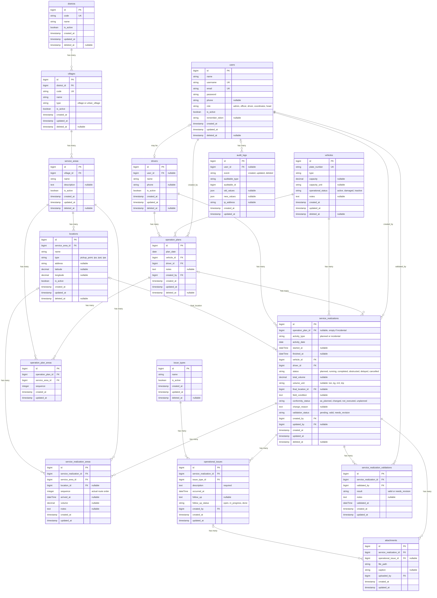

# PRD — Sistem Informasi Persampahan dan Monitoring Armada "SIPAMPAH"

| | |
| --- | --- |
| **Nama Sistem** | Sistem Informasi Persampahan dan Monitoring Armada "SIPAMPAH" |
| **Tanggal** | 23 September 2026 |
| **Disusun oleh** | Nadya Lovita Sari, A.Md.Kom — Pranata Komputer Terampil |
| **Instansi** | Dinas Lingkungan Hidup (DLH) Kabupaten Trenggalek |

---

## 1. Ringkasan Singkat

DLH Kabupaten Trenggalek membutuhkan sistem informasi untuk mencatat, memantau, dan mengolah data operasional persampahan serta aktivitas armada pengangkut sampah dalam satu sistem. SIPAMPAH dirancang untuk kondisi lapangan yang dinamis: jadwal pengambilan dan rute tidak selalu tetap dan dapat berubah berdasarkan volume sampah, kebutuhan wilayah, kondisi armada, situasi lapangan, serta keputusan koordinator/pengemudi.

Karena itu, SIPAMPAH tidak memaksakan jadwal atau rute tetap yang belum dimiliki DLH. Sistem menggunakan konsep **Rencana Operasional** bila tersedia dan **Realisasi Layanan** sebagai data utama. Kegiatan yang muncul tanpa rencana tetap dapat dicatat sebagai **Layanan Insidental/Aktual**.

Hasil yang diharapkan adalah satu sumber data untuk mengetahui armada yang beroperasi, wilayah yang benar-benar dilayani, waktu pelayanan, volume/tonase bila tersedia, kendala, serta pola pelayanan aktual. Data tersebut menjadi dasar dashboard, monitoring, evaluasi, dan laporan.

---

## 2. Siapa Saja yang Akan Memakai Sistem

| Peran | Contoh Orangnya | Bisa Ngapain Saja |
| --- | --- | --- |
| Admin Sistem | Admin/operator DLH | Mengatur akun, hak akses, master wilayah, armada, petugas, dan parameter sistem. |
| Petugas/Operator Persampahan | Staf/petugas bidang persampahan | Membuat rencana bila tersedia, mencatat realisasi layanan, volume/tonase, kendala, dan menyiapkan laporan. |
| Pengemudi/Operator Armada | Pengemudi kendaraan | Melihat tugas, memulai/menyelesaikan aktivitas, memilih wilayah aktual, serta mencatat kendala dan data sederhana. |
| Koordinator/Pengawas | Koordinator lapangan | Memantau aktivitas, memeriksa/validasi data, melihat rencana vs realisasi, dan memberi catatan. |
| Pimpinan | Kepala Dinas/pejabat berwenang | Melihat dashboard dan laporan tanpa mengubah data operasional. |

---

## 3. Layanan yang Ingin Dibuat Sistemnya

SIPAMPAH menggabungkan Dashboard Persampahan dan Monitoring Armada sebagai satu layanan informasi karena aktivitas armada merupakan bagian dari pelayanan persampahan. Sistem tidak mengasumsikan jadwal/rute tetap.

### Layanan A — Pencatatan dan Monitoring Layanan Persampahan Dinamis

**a) Apa langkah-langkahnya, dari layanan dimulai sampai selesai?**

1. Admin menyiapkan master kecamatan, desa/kelurahan, wilayah pelayanan, armada, pengemudi/petugas, dan lokasi/fasilitas yang tersedia.
2. Jika sudah ada rencana, petugas membuat Rencana Operasional. Rencana bersifat fleksibel, bukan jadwal tetap.
3. Jika tidak ada rencana, petugas/pengemudi dapat membuat kegiatan sebagai Layanan Insidental/Aktual.
4. Saat armada mulai bekerja, status menjadi Berangkat/Berjalan dan waktu mulai dicatat.
5. Petugas mencatat wilayah/lokasi yang benar-benar dilayani. Rute aktual dapat dicatat berdasarkan urutan wilayah/lokasi.
6. Volume/tonase dicatat bila tersedia, beserta kendala operasional.
7. Jika realisasi berbeda dari rencana, sistem menyimpan perbedaan dan meminta alasan perubahan.
8. Setelah selesai, status menjadi Selesai dan data akhir dilengkapi.
9. Koordinator memeriksa/validasi data. Data tersimpan menjadi sumber dashboard dan laporan.

**b) Data apa saja yang perlu disimpan sistem?**

- Tanggal dan waktu mulai/selesai
- Jenis kegiatan: Terencana atau Insidental/Aktual
- Wilayah rencana, bila ada
- Wilayah aktual: kecamatan, desa/kelurahan, lokasi/titik bila tersedia
- Armada dan pengemudi/operator
- Status: Direncanakan, Berangkat/Berjalan, Selesai, Terkendala, Tertunda, Dibatalkan
- Volume/tonase dan satuan
- Lokasi tujuan/pengelolaan akhir bila dicatat
- Alasan perubahan
- Keterangan kondisi lapangan
- Foto/dokumentasi bila diperlukan
- Pengguna dan waktu input/perubahan

**c) Ada aturan khusus yang harus dipatuhi sistem?**

- Tidak boleh menganggap jadwal pengambilan sebagai jadwal tetap apabila data tetap belum tersedia.
- Rute tidak wajib ditentukan sebelum kegiatan; simpan rute/wilayah aktual.
- Kegiatan tanpa rencana tetap sah dan diberi jenis Insidental/Aktual.
- Jika rencana berubah, sistem tidak menolak; sistem menyimpan alasan perubahan.
- Dashboard menggunakan realisasi sebagai sumber utama.
- Data tidak boleh terhitung dua kali saat diperbarui.
- Input pengemudi harus sederhana dan nyaman di telepon genggam.

---

### Layanan B — Monitoring Operasional dan Armada Sampah

**a) Langkah-langkahnya:**

1. Admin memasukkan identitas armada, nomor polisi/identitas kendaraan, jenis, kapasitas bila diketahui, dan status operasional.
2. Penugasan pengemudi/armada dibuat sesuai kondisi aktual; sistem tidak mengunci satu pengemudi pada satu armada.
3. Koordinator dapat memberi rencana tugas jika tersedia dan mengubahnya jika kondisi lapangan berubah.
4. Pengemudi membuka tugas atau membuat aktivitas aktual lalu menekan **Mulai Operasional**.
5. Pengemudi/petugas memilih wilayah aktual yang dilayani dan dapat menambah lokasi selama kegiatan.
6. Jika ada kendala, pilih **Terkendala** dan isi jenis/keterangan kendala.
7. Setelah selesai, tekan **Selesai** dan lengkapi data akhir.
8. Koordinator memeriksa data; data otomatis masuk dashboard.

**b) Data yang disimpan:**

- Identitas armada dan status
- Pengemudi/operator
- Waktu mulai/selesai
- Rencana tugas bila ada
- Wilayah dan rute aktual
- Status operasional
- Volume/tonase
- Kendala
- Alasan perubahan
- Dokumentasi
- Riwayat aktivitas armada

**c) Aturan khusus:**

- Armada tidak aktif/rusak tidak dapat dipilih untuk kegiatan baru kecuali diaktifkan Admin.
- Armada dapat melayani wilayah berbeda pada hari berbeda.
- Pengemudi dapat menggunakan armada berbeda sesuai penugasan.
- Status Terkendala wajib memiliki keterangan.
- Rencana awal tidak dihapus ketika tugas berubah; realisasi dan alasan perubahan disimpan.
- GPS real-time bukan syarat versi awal. Jika belum ada GPS, sistem tidak boleh mengklaim posisi real-time.

---

### Layanan C — Rencana Operasional vs Realisasi

Fitur ini bersifat pendukung. Tujuannya bukan membuat jadwal tetap, tetapi membandingkan rencana yang memang dibuat dengan apa yang benar-benar terjadi.

**a) Langkah-langkahnya:**

1. Petugas membuat rencana hanya bila tersedia.
2. Realisasi dicatat saat kegiatan berlangsung.
3. Jika sesuai, tandai *terlaksana sesuai*.
4. Jika berubah, simpan realisasi dan alasan perubahan.
5. Jika tidak terlaksana, simpan status dan alasan.
6. Kegiatan tanpa rencana tetap dicatat sebagai Insidental/Aktual.
7. Dashboard hanya membandingkan rencana–realisasi untuk kegiatan yang mempunyai rencana.

**b) Data yang disimpan:**

- Tanggal rencana
- Wilayah/armada/pengemudi rencana
- Data realisasi
- Status kesesuaian
- Alasan perubahan
- Catatan koordinator

**c) Aturan khusus:**

- Rencana fleksibel dan tidak wajib.
- Rencana tidak boleh menjadi dasar penolakan kegiatan.
- Realisasi tetap menjadi sumber utama statistik.

---

## 4. Laporan & Dashboard yang Dibutuhkan

Dashboard harus menggambarkan kondisi aktual. Karena jadwal dan rute bersifat dinamis, dashboard tidak hanya berupa kalender jadwal.

### Dashboard

| Ingin lihat apa? | Isi yang ditampilkan |
| --- | --- |
| Status Operasional Hari Ini | Armada beroperasi, berjalan, selesai, terkendala, dan tidak aktif. |
| Aktivitas Armada | Armada, pengemudi, waktu, wilayah aktual, status, dan waktu selesai. |
| Wilayah Terlayani | Frekuensi dan jumlah kegiatan per kecamatan/desa/kelurahan berdasarkan realisasi. |
| Volume/Tonase | Total harian/mingguan/bulanan/tahunan dan per wilayah/armada jika tersedia. |
| Rencana vs Realisasi | Rencana, sesuai, berubah, tidak terlaksana, dan insidental. |
| Kendala | Jenis kendala, armada terdampak, waktu, dan tindak lanjut. |
| Riwayat Armada | Riwayat kegiatan, wilayah, volume/tonase, dan kendala. |
| Pola Pelayanan | Frekuensi aktual per wilayah setelah data terkumpul; bukan klaim jadwal tetap. |

### Laporan Rutin

- Rekap aktivitas armada harian
- Rekap realisasi per kecamatan/desa/kelurahan
- Rekap volume/tonase per periode
- Rekap penggunaan armada
- Rekap kendala dan perubahan operasional
- Rekap rencana vs realisasi untuk kegiatan yang memiliki rencana
- Rekap kegiatan insidental
- Riwayat operasional armada
- Ekspor Excel dan PDF untuk Monev, rapat, dan pelaporan

---

## 5. Catatan untuk AI Coding Assistant

Bagian ini menerjemahkan layanan menjadi modul, langkah menjadi status, data menjadi kolom database, aturan menjadi validasi, serta dashboard menjadi tampilan dan ekspor.

- Nama aplikasi: **SIPAMPAH — Sistem Informasi Persampahan dan Monitoring Armada**.
- Satu sistem dan satu basis data untuk persampahan dan aktivitas armada.
- Jangan membuat asumsi jadwal atau rute tetap yang belum dimiliki DLH.
- Gunakan **Rencana Operasional** (opsional) dan **Realisasi Layanan** (utama).
- Gunakan **Layanan Insidental/Aktual** untuk kegiatan tanpa rencana.
- Gunakan **Wilayah Pelayanan** dan **Rute Aktual**, bukan Master Rute Tetap.
- Dashboard menghitung indikator berdasarkan realisasi.
- Jangan membuat data fiktif jika data awal belum tersedia.
- Input pengemudi harus sederhana dan responsif di telepon genggam.
- Jika rencana berubah, simpan rencana, realisasi, dan alasan perubahan.
- Jangan menolak kegiatan karena tidak memiliki jadwal awal.
- Jangan menampilkan GPS real-time jika belum terintegrasi.
- Sediakan riwayat perubahan data penting/audit trail.
- Sediakan filter periode, wilayah, armada, pengemudi, status, dan jenis kegiatan.
- Sediakan ekspor Excel/PDF.
- Perubahan master tidak boleh menghapus histori operasional.

---

## 6. Batasan dan Tahapan Pengembangan

Versi awal SIPAMPAH tidak bergantung pada jadwal tetap, rute tetap, GPS, atau sensor timbangan. Fokus awal adalah membangun sumber data operasional yang konsisten.

| Tahap | Nama Tahap | Cakupan |
| --- | --- | --- |
| 1 | Master Data | Armada, pengemudi/petugas, kecamatan, desa/kelurahan, wilayah pelayanan. |
| 2 | Operasional Harian | Mulai aktivitas, wilayah aktual, status, volume/tonase bila tersedia, kendala, selesai. |
| 3 | Dashboard | Status armada, realisasi, volume/tonase, wilayah terlayani, kendala. |
| 4 | Rencana vs Realisasi | Digunakan saat DLH mulai membuat rencana operasional. |
| 5 | Analisis Pola | Frekuensi pelayanan dan pola aktual berdasarkan histori. |
| 6 | Pengembangan Lanjutan | GPS/tracking, integrasi timbangan, peta interaktif, atau integrasi sistem lain. |

---

## 7. Prinsip Utama SIPAMPAH

SIPAMPAH tidak dibuat untuk memaksa kondisi lapangan menjadi kaku. SIPAMPAH dibuat untuk mendokumentasikan kondisi lapangan yang memang dinamis sehingga DLH secara bertahap memiliki data aktual yang dapat digunakan untuk monitoring dan pengambilan keputusan.

> **"Catat yang Terjadi, Pantau yang Berjalan, Kelola Berdasarkan Data."**

Ketiadaan jadwal dan rute tetap bukan hambatan sistem. Justru SIPAMPAH digunakan untuk membangun data historis dari aktivitas nyata. Setelah data terkumpul, DLH dapat melihat pola pelayanan aktual dan menggunakannya sebagai dasar evaluasi serta perencanaan operasional.

---

## 8. ER Diagram (Rancangan Basis Data)

ER Diagram di bawah ini menerjemahkan Bagian 3 (data yang disimpan) dan Bagian 5 (catatan untuk AI) menjadi tabel database dengan **standar penamaan Laravel**:

- Nama tabel: bahasa Inggris, `snake_case`, bentuk **jamak** (`vehicles`, `service_areas`).
- Nama kolom: bahasa Inggris, `snake_case`. Primary key `id`.
- Foreign key: `{nama_model_tunggal}_id` (contoh `vehicle_id`, `service_area_id`). Pengecualian: `created_by`, `updated_by`, `validated_by`, dan `uploaded_by` yang mengarah ke `users.id`.
- Semua tabel memiliki `created_at` dan `updated_at` (`$table->timestamps()`).
- Tabel master dan tabel operasional utama memakai `deleted_at` (`$table->softDeletes()`), sehingga data tidak hilang permanen.
- Kolom boolean diawali `is_` (contoh `is_active`).
- Tipe kolom mengikuti tipe migration Laravel (`string`, `text`, `date`, `dateTime`, `decimal`, `boolean`, `json`, `timestamp`, `bigint` untuk `id` dan foreign key).

Diagram memakai sintaks [Mermaid](https://mermaid.js.org/) sehingga otomatis tampil sebagai gambar di GitHub, GitLab, VS Code (dengan ekstensi Markdown Preview Mermaid), Obsidian, dan Notion.

### Padanan Nama Tabel (Indonesia → Inggris)

| Istilah di PRD | Tabel (Laravel) | Model Eloquent |
| --- | --- | --- |
| Pengguna | `users` | `User` |
| Kecamatan | `districts` | `District` |
| Desa/Kelurahan | `villages` | `Village` |
| Wilayah Pelayanan | `service_areas` | `ServiceArea` |
| Lokasi/Titik/Fasilitas | `locations` | `Location` |
| Armada | `vehicles` | `Vehicle` |
| Pengemudi | `drivers` | `Driver` |
| Jenis Kendala | `issue_types` | `IssueType` |
| Rencana Operasional | `operation_plans` | `OperationPlan` |
| Wilayah dalam Rencana | `operation_plan_areas` | `OperationPlanArea` |
| Realisasi Layanan | `service_realizations` | `ServiceRealization` |
| Rute Aktual (wilayah yang dilayani) | `service_realization_areas` | `ServiceRealizationArea` |
| Kendala Operasional | `operational_issues` | `OperationalIssue` |
| Dokumentasi/Foto | `attachments` | `Attachment` |
| Validasi Koordinator | `service_realization_validations` | `ServiceRealizationValidation` |
| Riwayat Perubahan (audit trail) | `audit_logs` | `AuditLog` |

### Nilai Status (Enum)

| Kolom | Nilai |
| --- | --- |
| `users.role` | `admin`, `officer`, `driver`, `coordinator`, `head` |
| `villages.type` | `village`, `urban_village` |
| `locations.type` | `pickup_point`, `tps`, `tpst`, `tpa` |
| `vehicles.operational_status` | `active`, `damaged`, `inactive` |
| `service_realizations.activity_type` | `planned`, `incidental` |
| `service_realizations.status` | `planned`, `running`, `completed`, `obstructed`, `delayed`, `cancelled` |
| `service_realizations.conformity_status` | `as_planned`, `changed`, `not_executed`, `unplanned` |
| `service_realizations.validation_status` | `pending`, `valid`, `needs_revision` |
| `service_realizations.volume_unit` | `ton`, `kg`, `m3`, `trip` |
| `operational_issues.follow_up_status` | `open`, `in_progress`, `done` |
| `service_realization_validations.result` | `valid`, `needs_revision` |

### Catatan Rancangan

- **Rencana opsional.** `service_realizations.operation_plan_id` boleh kosong (`nullable`). Jika kosong, `activity_type` = `incidental` dan `conformity_status` = `unplanned`.
- **Realisasi sebagai sumber utama.** Dashboard dan statistik dihitung dari `service_realizations` dan `service_realization_areas`. Rencana hanya dibaca untuk laporan rencana vs realisasi.
- **Tidak ada hitung ganda volume.** Total per kegiatan diambil dari `total_volume`. Kolom `service_realization_areas.volume` hanya rincian opsional per wilayah, dan jumlahnya tidak boleh melebihi `total_volume`. Jangan menjumlahkan keduanya.
- **Status `obstructed` wajib keterangan.** Kegiatan berstatus `obstructed` harus punya minimal satu baris `operational_issues` dengan `description` terisi.
- **Kendaraan tidak aktif tidak bisa dipilih.** Validasi pada form (Form Request): `vehicles.operational_status` harus `active` untuk kegiatan baru, kecuali diaktifkan Admin.
- **Histori master tidak hilang.** Master (`vehicles`, `drivers`, `service_areas`, dll.) memakai soft delete dan kolom `is_active`, sehingga data lama tetap utuh. Foreign key ke master memakai `restrictOnDelete()`.
- **Jejak pengguna.** `created_by` dan `updated_by` mengarah ke `users.id`, sesuai kebutuhan mencatat pengguna dan waktu input/perubahan. Sebagian relasi ke `users` (misalnya `updated_by`, `uploaded_by`) tidak digambar agar diagram tetap terbaca.
- **Tanpa GPS.** `latitude` dan `longitude` pada `locations` hanya koordinat titik tetap (opsional), bukan posisi real-time kendaraan.
- **Satu pengemudi bisa banyak kendaraan, dan sebaliknya.** Tidak ada kolom yang mengunci keduanya. Penugasan tercatat langsung di `operation_plans` dan `service_realizations`.
- **Audit trail.** Struktur `audit_logs` (`event`, `auditable_type`, `auditable_id`, `old_values`, `new_values`) bersifat polimorfik dan mirip skema paket audit Laravel yang umum dipakai, sehingga mudah diganti dengan paket tersebut.
