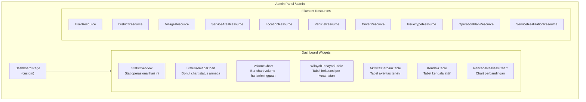

# 🚛 Rencana Aksi — Dashboard SIPAMPAH (Filament v5)

> **Proyek:** SIPAMPAH — Sistem Informasi Persampahan dan Monitoring Armada
> **Stack:** Laravel 13 · Filament 5.8 · Livewire 4 · PHP 8.4
> **Tanggal:** 25 September 2026

---

## Status Saat Ini

| Komponen | Status |
|---|---|
| Models (16 file) | ✅ Selesai |
| Migrations (19 file) | ✅ Selesai |
| Enums (11 file) | ✅ Selesai |
| Seeders | ✅ Selesai |
| AdminPanelProvider | ✅ Selesai (konfigurasi dasar) |
| **Filament Resources** | ❌ Belum ada |
| **Filament Pages** | ❌ Belum ada |
| **Filament Widgets** | ❌ Belum ada |

---

## Arsitektur Dashboard



---

## Fase Pengerjaan

### Fase 1 — Konfigurasi Panel & Navigasi *(~30 menit)*

> [!IMPORTANT]
> Fase ini menyiapkan fondasi panel admin: branding, warna, navigasi, dan role-based access.

| # | Task | File yang Dibuat/Diubah | Detail |
|---|---|---|---|
| 1.1 | Konfigurasi branding panel | [AdminPanelProvider.php](file:///c:/laragon/www/app-layanan/app/Providers/Filament/AdminPanelProvider.php) | Set `brandName('SIPAMPAH')`, favicon, `sidebarCollapsibleOnDesktop()`, `topNavigation()` sesuai preferensi |
| 1.2 | Set color scheme | [AdminPanelProvider.php](file:///c:/laragon/www/app-layanan/app/Providers/Filament/AdminPanelProvider.php) | Ganti `Color::Amber` → warna hijau DLH (`Color::Emerald` atau custom hex) |
| 1.3 | Konfigurasi navigation groups | [AdminPanelProvider.php](file:///c:/laragon/www/app-layanan/app/Providers/Filament/AdminPanelProvider.php) | Tambah `navigationGroups`: Master Data, Operasional, Monitoring |
| 1.4 | Hapus default widgets | [AdminPanelProvider.php](file:///c:/laragon/www/app-layanan/app/Providers/Filament/AdminPanelProvider.php) | Hapus `AccountWidget`, `FilamentInfoWidget` dari `widgets()` |
| 1.5 | Buat Policy untuk role-based access | `app/Policies/*Policy.php` | Buat policies untuk membatasi akses berdasarkan `UserRole` enum |

---

### Fase 2 — Resources Master Data *(~2 jam)*

> [!NOTE]
> Semua resource master data memiliki pola yang sama: CRUD sederhana, soft delete, dan toggle `is_active`.

| # | Task | File yang Dibuat | Detail |
|---|---|---|---|
| 2.1 | UserResource | `app/Filament/Resources/UserResource.php` + Pages | Tabel: name, username, email, role (badge), is_active (toggle). Form: TextInput, Select (UserRole enum), Toggle. Filter: role, is_active |
| 2.2 | DistrictResource | `app/Filament/Resources/DistrictResource.php` + Pages | Tabel: code, name, is_active, jumlah desa. Form: code, name, Toggle. Relasi: villages count |
| 2.3 | VillageResource | `app/Filament/Resources/VillageResource.php` + Pages | Tabel: code, name, type (badge VillageType), district, is_active. Form: Select district, code, name, Select type, Toggle |
| 2.4 | ServiceAreaResource | `app/Filament/Resources/ServiceAreaResource.php` + Pages | Tabel: name, village (+ district), is_active, jumlah lokasi. Form: Select village (searchable), name, description, Toggle |
| 2.5 | LocationResource | `app/Filament/Resources/LocationResource.php` + Pages | Tabel: name, type (badge LocationType), service_area, is_active. Form: Select service_area, name, Select type, address, lat/lng, Toggle |
| 2.6 | VehicleResource | `app/Filament/Resources/VehicleResource.php` + Pages | Tabel: plate_number, type, capacity, operational_status (badge). Form: plate_number, type, capacity, capacity_unit, Select status, notes. Filter: operational_status |
| 2.7 | DriverResource | `app/Filament/Resources/DriverResource.php` + Pages | Tabel: name, phone, user (link), is_active. Form: name, phone, Select user (nullable, searchable), Toggle |
| 2.8 | IssueTypeResource | `app/Filament/Resources/IssueTypeResource.php` + Pages | Simple resource. Tabel: name, is_active. Form: name, Toggle |

**Konvensi per resource:**
- Gunakan `php artisan make:filament-resource` dengan `--generate` flag
- Navigasi group: `'Master Data'`
- Semua resource mengimplementasi `SoftDeleteBulkAction` dan `RestoreAction`
- Filter global: `TrashedFilter`

---

### Fase 3 — Resources Operasional *(~3 jam)*

> [!IMPORTANT]
> Ini adalah resource inti aplikasi. `ServiceRealizationResource` adalah yang paling kompleks.

| # | Task | File yang Dibuat | Detail |
|---|---|---|---|
| 3.1 | OperationPlanResource | `app/Filament/Resources/OperationPlanResource.php` + Pages | **Tabel:** plan_date, vehicle, driver, jumlah wilayah rencana, created_by. **Form:** DatePicker plan_date, Select vehicle (filter `operational_status = active`), Select driver (filter `is_active`), Repeater untuk `operation_plan_areas` (Select service_area, sequence). **Filter:** plan_date range, vehicle, driver |
| 3.2 | ServiceRealizationResource | `app/Filament/Resources/ServiceRealizationResource.php` + Pages | Lihat detail di bawah ⬇️ |
| 3.3 | OperationalIssue inline | Di dalam ServiceRealizationResource | Relation Manager `OperationalIssuesRelationManager`: tabel dan form inline di halaman detail realisasi |
| 3.4 | Attachment inline | Di dalam ServiceRealizationResource | Relation Manager `AttachmentsRelationManager`: upload file, caption, preview gambar |
| 3.5 | Validation inline | Di dalam ServiceRealizationResource | Relation Manager `ValidationsRelationManager`: form validasi oleh koordinator |

#### Detail ServiceRealizationResource (3.2)

**Tabel (List Page):**

| Kolom | Tipe Filament | Keterangan |
|---|---|---|
| `activity_date` | `DateColumn` | Sortable, default descending |
| `activity_type` | `BadgeColumn` | Warna berbeda: planned=info, incidental=warning |
| `vehicle.plate_number` | `TextColumn` | Searchable |
| `driver.name` | `TextColumn` | Searchable |
| `status` | `BadgeColumn` | Warna dari `RealizationStatus::getColor()` |
| `total_volume` | `TextColumn` | Suffix volume_unit, default '-' jika null |
| `validation_status` | `BadgeColumn` | Warna dari `ValidationStatus` |
| `started_at` | `DateTimeColumn` | Format `H:i` |
| Wilayah dilayani | `TextColumn` | Count `realizationAreas` |

**Form (Create/Edit Page):**

```
┌─────────────── Section: Informasi Kegiatan ───────────────┐
│ activity_type (Select/Radio)  │  activity_date (DatePicker)│
│ operation_plan_id (Select)    │  [visible if planned]      │
├─────────────── Section: Armada & Pengemudi ────────────────┤
│ vehicle_id (Select, searchable, filter active)             │
│ driver_id (Select, searchable, filter active)              │
├─────────────── Section: Waktu & Status ────────────────────┤
│ started_at (DateTimePicker)   │  finished_at (DateTimePicker)│
│ status (Select RealizationStatus)                          │
├─────────────── Section: Volume ────────────────────────────┤
│ total_volume (TextInput, numeric) │ volume_unit (Select)   │
│ final_location_id (Select, searchable)                     │
├─────────────── Section: Rute Aktual ───────────────────────┤
│ Repeater: service_realization_areas                        │
│   ├─ service_area_id (Select)                              │
│   ├─ location_id (Select, dependent on service_area)       │
│   ├─ sequence (auto-increment)                             │
│   ├─ arrived_at (DateTimePicker)                           │
│   ├─ volume (TextInput, numeric, nullable)                 │
│   └─ notes (Textarea)                                      │
├─────────────── Section: Keterangan ────────────────────────┤
│ field_condition (Textarea)                                 │
│ conformity_status (Select, visible if planned)             │
│ change_reason (Textarea, visible if conformity != as_planned)│
└────────────────────────────────────────────────────────────┘
```

**Filters:**
- `SelectFilter` status
- `SelectFilter` activity_type
- `SelectFilter` validation_status
- `SelectFilter` vehicle
- `SelectFilter` driver
- `Filter` date range (activity_date)

**Actions:**
- `Action::make('mulaiOperasional')` → set status=running, started_at=now()
- `Action::make('selesai')` → set status=completed, finished_at=now()
- `Action::make('terkendala')` → set status=obstructed, wajib isi kendala
- `Action::make('validasi')` → modal form untuk koordinator, buat `ServiceRealizationValidation`

**Navigasi group:** `'Operasional'`

---

### Fase 4 — Dashboard Widgets *(~3 jam)*

> [!TIP]
> Semua widget mengambil data dari `service_realizations` (realisasi) sebagai sumber utama, sesuai prinsip PRD.

| # | Widget | Tipe | File | Detail |
|---|---|---|---|---|
| 4.1 | StatsOverviewWidget | `StatsOverviewWidget` | `app/Filament/Widgets/StatsOverviewWidget.php` | **4 stat cards:** Armada Beroperasi (hari ini), Kegiatan Selesai, Total Volume (hari ini), Kendala Aktif. Gunakan `Stat::make()->description()->descriptionIcon()->chart()` dengan trend 7 hari |
| 4.2 | StatusOperasionalChart | `ChartWidget` | `app/Filament/Widgets/StatusOperasionalChart.php` | **Doughnut chart:** breakdown status realisasi hari ini (running, completed, obstructed, delayed, cancelled). Warna sesuai `RealizationStatus::getColor()` |
| 4.3 | VolumeSampahChart | `ChartWidget` | `app/Filament/Widgets/VolumeSampahChart.php` | **Bar chart:** volume harian 7 hari terakhir. Filter toggle: harian/mingguan/bulanan. Grouping by `activity_date`, `SUM(total_volume)` |
| 4.4 | WilayahTerlayaniWidget | `TableWidget` | `app/Filament/Widgets/WilayahTerlayaniWidget.php` | **Tabel:** Kecamatan, Jumlah Kegiatan (bulan ini), Jumlah Desa Terlayani. Query: join `service_realization_areas` → `service_areas` → `villages` → `districts`. Group by district |
| 4.5 | AktivitasTerbaruWidget | `TableWidget` | `app/Filament/Widgets/AktivitasTerbaruWidget.php` | **Tabel 10 aktivitas terbaru:** tanggal, armada, pengemudi, wilayah, status badge, volume. Sortable, dengan link ke detail |
| 4.6 | KendalaAktifWidget | `TableWidget` | `app/Filament/Widgets/KendalaAktifWidget.php` | **Tabel kendala:** tanggal, armada, jenis kendala, deskripsi, follow_up_status badge. Filter: `follow_up_status != done` |
| 4.7 | RencanaRealisasiChart | `ChartWidget` | `app/Filament/Widgets/RencanaRealisasiChart.php` | **Stacked bar chart:** jumlah kegiatan per conformity_status (as_planned, changed, not_executed, unplanned) per minggu. Hanya relevan jika ada data rencana |

---

### Fase 5 — Custom Dashboard Page *(~1 jam)*

| # | Task | File | Detail |
|---|---|---|---|
| 5.1 | Buat custom Dashboard page | `app/Filament/Pages/Dashboard.php` | Override default `Filament\Pages\Dashboard`. Tambah header filter: date range, kecamatan, armada. Filter diteruskan ke semua widget via `$this->filters` |
| 5.2 | Atur layout widget | `app/Filament/Pages/Dashboard.php` | `StatsOverview` → full width. Baris 2: `StatusOperasionalChart` (1/3) + `VolumeSampahChart` (2/3). Baris 3: `WilayahTerlayaniWidget` (1/2) + `AktivitasTerbaruWidget` (1/2). Baris 4: `KendalaAktifWidget` (1/2) + `RencanaRealisasiChart` (1/2) |
| 5.3 | Role-based widget visibility | Masing-masing widget | Driver hanya lihat `AktivitasTerbaruWidget` miliknya. Head dan Coordinator lihat semua. Admin dan Officer lihat semua |

**Layout Dashboard:**

```
┌────────────────────────── Filter Bar ──────────────────────────┐
│  📅 Rentang Tanggal    📍 Kecamatan    🚛 Armada    🔄 Reset  │
├────────────────────────────────────────────────────────────────┤
│  [🚛 Armada Aktif]  [✅ Selesai Hari Ini]  [📦 Volume]  [⚠️ Kendala]  │
│                    StatsOverviewWidget (full width)            │
├────────────────────┬───────────────────────────────────────────┤
│  Status Operasional│         Volume Sampah                    │
│  (Doughnut 1/3)    │         (Bar Chart 2/3)                  │
├────────────────────┴──────────┬────────────────────────────────┤
│  Wilayah Terlayani (Tabel)   │   Aktivitas Terbaru (Tabel)   │
│  (1/2)                        │   (1/2)                       │
├───────────────────────────────┼────────────────────────────────┤
│  Kendala Aktif (Tabel)       │   Rencana vs Realisasi (Chart)│
│  (1/2)                        │   (1/2)                       │
└───────────────────────────────┴────────────────────────────────┘
```

---

### Fase 6 — Polish & Fitur Tambahan *(~2 jam)*

| # | Task | Detail |
|---|---|---|
| 6.1 | Export Excel/PDF | Tambahkan `ExportAction` pada `ServiceRealizationResource` (list page) dan tiap table widget. Gunakan Filament Export built-in atau `maatwebsite/excel` |
| 6.2 | Global Search | Enable global search di `AdminPanelProvider`. Register `ServiceRealization`, `Vehicle`, `Driver` sebagai globally searchable |
| 6.3 | Database Notifications | Notifikasi Filament untuk: kegiatan terkendala → kirim ke Koordinator; validasi selesai → kirim ke Petugas |
| 6.4 | Dark mode | `->darkMode(true)` di AdminPanelProvider |
| 6.5 | Tests | Buat feature tests: resource CRUD, widget query accuracy, policy access control |
| 6.6 | Run Pint | `vendor/bin/pint --dirty --format agent` setelah semua perubahan |

---

## Urutan Eksekusi yang Disarankan

```mermaid
gantt
    title Urutan Eksekusi Dashboard SIPAMPAH
    dateFormat HH:mm
    axisFormat %H:%M

    section Fase 1
    Konfigurasi Panel           :f1, 00:00, 30m

    section Fase 2
    Resource Master Data        :f2, after f1, 120m

    section Fase 3
    Resource Operasional        :f3, after f2, 180m

    section Fase 4
    Dashboard Widgets           :f4, after f3, 180m

    section Fase 5
    Custom Dashboard Page       :f5, after f4, 60m

    section Fase 6
    Polish dan Fitur Tambahan   :f6, after f5, 120m
```



---

## Perintah Artisan yang Akan Digunakan

```bash
# Fase 2 & 3 — Generate resources
php artisan make:filament-resource User --generate --no-interaction
php artisan make:filament-resource District --generate --no-interaction
php artisan make:filament-resource Village --generate --no-interaction
php artisan make:filament-resource ServiceArea --generate --no-interaction
php artisan make:filament-resource Location --generate --no-interaction
php artisan make:filament-resource Vehicle --generate --no-interaction
php artisan make:filament-resource Driver --generate --no-interaction
php artisan make:filament-resource IssueType --generate --no-interaction
php artisan make:filament-resource OperationPlan --generate --no-interaction
php artisan make:filament-resource ServiceRealization --generate --no-interaction

# Fase 3 — Relation managers
php artisan make:filament-relation-manager ServiceRealizationResource issues issue_type_id --no-interaction
php artisan make:filament-relation-manager ServiceRealizationResource attachments file_path --no-interaction
php artisan make:filament-relation-manager ServiceRealizationResource validations result --no-interaction

# Fase 4 — Widgets
php artisan make:filament-widget StatsOverview --stats-overview --no-interaction
php artisan make:filament-widget StatusOperasionalChart --chart --no-interaction
php artisan make:filament-widget VolumeSampahChart --chart --no-interaction
php artisan make:filament-widget WilayahTerlayaniWidget --table --no-interaction
php artisan make:filament-widget AktivitasTerbaruWidget --table --no-interaction
php artisan make:filament-widget KendalaAktifWidget --table --no-interaction
php artisan make:filament-widget RencanaRealisasiChart --chart --no-interaction

# Fase 5 — Custom page
php artisan make:filament-page Dashboard --no-interaction

# Fase 6 — Formatting
vendor/bin/pint --dirty --format agent
```

---

## Catatan Penting

> [!WARNING]
> - **Realisasi sebagai sumber utama.** Semua statistik dashboard dihitung dari `service_realizations`, bukan dari `operation_plans`.
> - **Tidak boleh hitung ganda volume.** Total volume diambil dari `total_volume`, bukan penjumlahan `service_realization_areas.volume`.
> - **Kendaraan `damaged`/`inactive` tidak bisa dipilih** untuk kegiatan baru — validasi di form Select.
> - **Status `obstructed` wajib keterangan** — validasi di form: jika status = obstructed, harus ada minimal 1 `operational_issues`.
> - **Tanpa GPS real-time** — tidak ada widget peta/tracking di versi awal.

> [!NOTE]
> Estimasi total: **~11,5 jam kerja**. Bisa dieksekusi bertahap per fase. Setiap fase bisa di-review dan di-test secara independen sebelum lanjut ke fase berikutnya.
